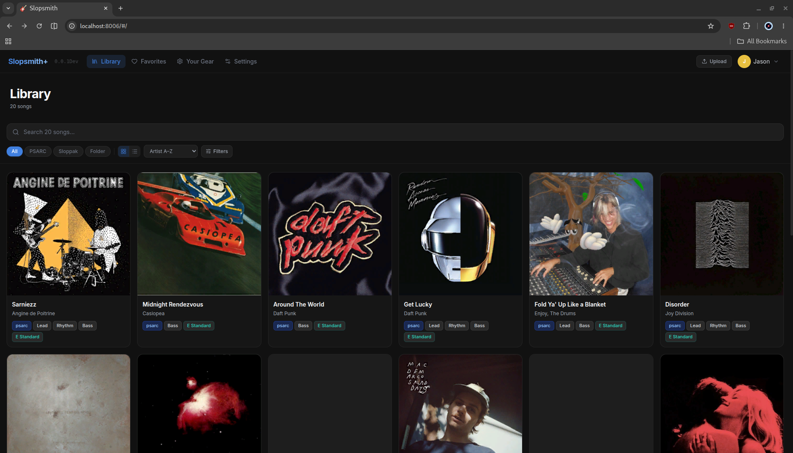
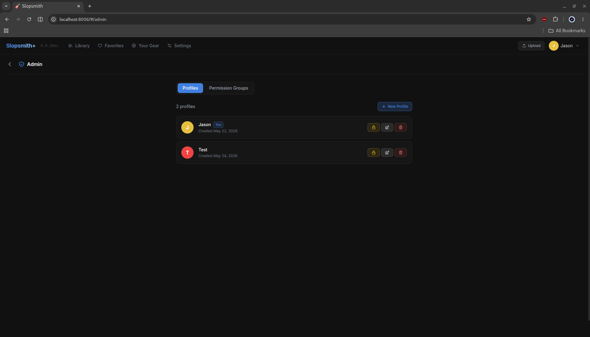
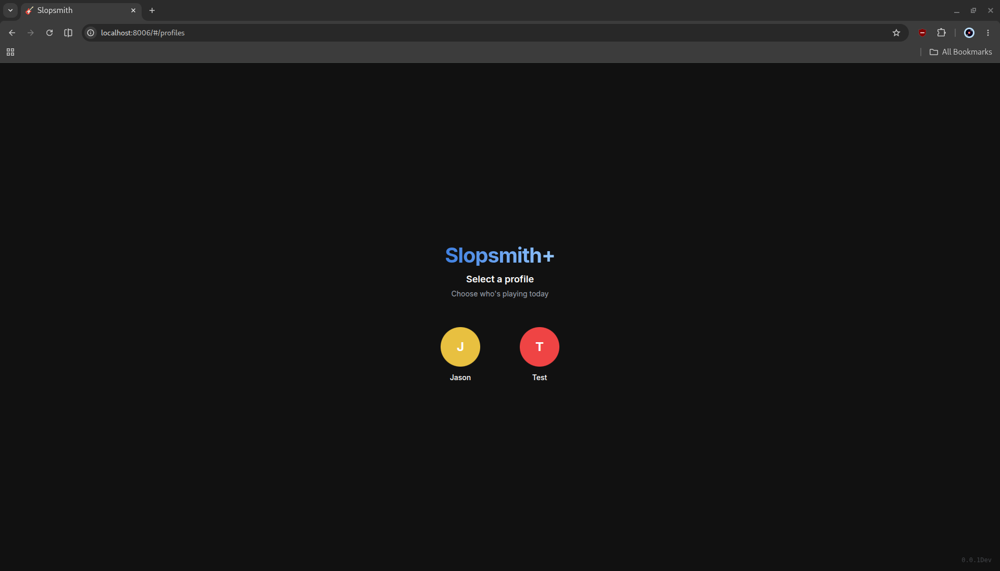

# Slopsmith Plus

> Browse, play, and practice your Rocksmith 2014 CDLC collection — entirely in your browser, entirely in Docker. 


[](https://www.youtube.com/watch?v=f_XTS9tVeaU)

| | |
|---|---|
|  |  |
|  |  |

---

## Contents

- [Quick Start](#quick-start)
- [Features](#features)
- [Configuration](#configuration)
- [Deployment](#deployment)
  - [Docker Compose](#docker-compose)
  - [Apache Reverse Proxy](#apache-reverse-proxy)
  - [Proxmox LXC](#proxmox-lxc)
  - [Portainer](#portainer)
- [Diagnostics](#diagnostics)
- [Tech Stack](#tech-stack)
- [License](#license)

---

## Quick Start

**Requirements:** [Docker](https://docs.docker.com/get-docker/) and [Docker Compose](https://docs.docker.com/compose/install/)

```bash
git clone https://github.com/johncoco12/SlopSmith-Plus
cd slopsmith-plus
docker compose up -d
```

Open **http://localhost:8006** in your browser. On first launch the app scans your DLC folder in the background — the library is usable immediately while the scan runs.

### Services

| Service | Port | Description |
|---------|------|-------------|
| Frontend | `8006` | Vue 3 SPA served by Nginx |
| Backend API | `8085` | Fastify REST + WebSocket |
| PostgreSQL | `5432` | Song library database |
| MinIO | `9000` | Object storage (cover art, audio) |
| MinIO Console | `9001` | MinIO admin UI |

---

## Features

### Library Browser

- **Grid View** — album art cards with arrangement badges, tuning, and lyrics indicator
- **Artist / Album Tree** — hierarchical browser with A–Z letter filter and expandable groups
- **Search & Filter** — by title, artist, album, format (PSARC / Sloppak / Loose), arrangement, stems, lyrics, and tuning
- **Sort** — by artist, title, recently added, tuning, or year
- **Favorites** — heart-mark songs and browse them in a dedicated view
- **Edit Metadata** — update title, artist, album, and cover art in place
- **Retune to E Standard** — pitch-shift songs in Eb / D / C# / C Standard with one click

### Note Highway Player

Real-time note highway rendering Rocksmith arrangements in two selectable visualization engines: a **3D highway** with depth-aware camera, lighting, and per-string lane glow, and a **Classic 2D highway** for lower-powered devices.

**Note rendering**
- Fret-positioned notes in string colors (red, orange, blue, orange, green, purple)
- Open string bars spanning the full highway width
- Chord brackets with chord name labels
- Sustain tails held until the note ends

**Techniques**
- Bends — curved arrows with labels (1/2 · full · 1-1/2 · 2)
- Unison bends — dashed connector
- Slides — diagonal arrow
- Hammer-ons / Pull-offs / Taps — H / P / T labels
- Palm mutes — PM label
- Vibrato — animated sustain
- Tremolo — wavy line
- Accents — > marker
- Harmonics — diamond shape
- Pinch harmonics — diamond + PH label

**Note recognition** — real-time pitch detection via the YIN algorithm compiled to WASM

**Player controls**
- Synced lyrics (phrase-based, multi-row, karaoke highlighting) — toggleable
- Dynamic anchor zoom — fret window adjusts smoothly and looks ahead
- Arrangement switcher — swap Lead / Rhythm / Bass mid-playback
- Speed slider — 0.25× to 1.50× continuous
- Volume control

### Practice Tools

- **A-B Looping** — set start and end points to repeat any section
- **Saved Loops** — name and store multiple loops per song, persisted across sessions *planed 
- **4-Count Click** — tempo-matched metronome count-in before each repetition *planed 
- **Rewind Effect** — highway smoothly rewinds to the loop start point *planed 

### CDLC Creation *(coming soon)*

- **Guitar Pro → CDLC** — search Ultimate Guitar for GP3 / GP4 / GP5 tabs and convert them to playable CDLC with MIDI audio (plugin) *planing phase ( build in feature when creator is done )

### Profiles & Access Control

- **Multi-Profile** — create and switch between profiles, each with isolated settings and session data
- **PIN Protection** — 4–32 character PINs with recovery phrases
- **Avatars** — assign a custom avatar to each profile
- **Permission Groups** — admin and user-level access control

### Plugin System *(experimental)*

Slopsmith Plus includes an experimental plugin architecture. Plugins can extend the UI, add server-side API routes, register settings panels, and hook into the player.

**Bundled plugins** (ship with the app):

| Plugin | Description |
|--------|-------------|
| **Themes** | Color theme picker — 9 built-in themes (Default, Obsidian, Ember, Rose, Sage, Violet, Solarized, Light, Solarized Light) with server-side persistence |
| **Leaderboard** | Per-song score tracking and global leaderboards |
| **YIN Pitch Detector** | Real-time pitch detection via the YIN algorithm compiled to WASM |

> **Note:** The plugin system is experimental — APIs, hooks, and the plugin manifest format may change between releases. If you are building a third-party plugin, expect breaking changes until the API stabilizes. Legacy Slopsmith plugins are **not** supported yet.

### Compatibility & Scalability

- Custom CDLC (CustomsForge, etc.) and official Rocksmith DLC
- Official DLC: SNG binary auto-converted to XML via built-in RsCli tool
- Format support: PSARC (AES-CFB-128 in-memory), Sloppak (JSON), and loose folder layouts
- 8-thread parallel metadata extraction, non-blocking background scan
- PostgreSQL-backed server-side pagination — tested beyond 80,000 songs

---

## Configuration

| Variable | Default | Description |
|----------|---------|-------------|
| `DLC_PATH` | `~/.local/share/Steam/steamapps/common/Rocksmith2014/dlc` | DLC folder on the host |
| `LOG_LEVEL` | `info` | `trace` · `debug` · `info` · `warn` · `error` |
| `LOG_PRETTY` | `true` | `false` for structured JSON output (Loki, ELK, Promtail) |

The DLC folder and default arrangement (Lead / Rhythm / Bass) can also be changed at any time in **Settings**.

---

## Deployment

### Docker Compose

The repository ships a ready-to-use `docker-compose.yml`. Start with:


For a custom stack (e.g. different ports or passwords), copy and edit `docker-compose.yml` directly.

### Apache Reverse Proxy

Add the following to your virtual host and restart Apache:

```apache
ProxyPass /slopsmith/ http://localhost:8006/
ProxyPassReverse /slopsmith/ http://localhost:8006/

ProxyPass /api/    http://localhost:8085/api/
ProxyPassReverse /api/ http://localhost:8085/api/

ProxyPass /ws      ws://localhost:8085/ws

ProxyPass /static/ http://localhost:8085/static/
ProxyPassReverse /static/ http://localhost:8085/static/

ProxyPass /audio/  http://localhost:8085/audio/
ProxyPassReverse /audio/ http://localhost:8085/audio/
```

```bash
sudo a2enmod proxy proxy_http proxy_wstunnel
sudo systemctl restart apache2
```

> **Note:** Slopsmith uses absolute paths (`/api/`, `/static/`, etc.), so each path must be proxied at the virtual-host root. To avoid collisions with an existing site, use a dedicated subdomain such as `slopsmith.your-domain.com`.

### Portainer

**1. Install Docker**
```bash
sudo apt update && sudo apt install docker.io -y
sudo usermod -aG docker $USER
```

**2. Install Portainer** (runs on port 8888 to avoid conflicts)
```bash
docker run -d -p 8888:9000 --restart always \
  -v /var/run/docker.sock:/var/run/docker.sock \
  portainer/portainer-ce:latest
```

**3.** Open `http://server-ip:8888`, go to **Stacks → Add Stack**, and paste the contents of `docker-compose.yml`. Update `DLC_PATH` to match your host path.

**4.** Access Slopsmith at `http://server-ip:8006`.

**5.** Install recommended plugins from **Settings → Plugins**:
- **NAM Tone Engine** — connects Slopsmith to your guitar/audio interface. Amp models and cabinet IRs available at [tone3000.com](https://www.tone3000.com/)
- **Note Detection** — enables real-time pitch detection while you play

**Windows 11 install tutorial:** https://youtu.be/bIz8pbTFiV8

---

## Diagnostics

**Settings → Diagnostics → Export Diagnostics** produces a zip bundle containing everything needed to triage a bug:

- Server logs and Slopsmith version
- Hardware info (CPU, RAM, GPU) — works in Docker, Electron, and bare Node.js
- Plugin inventory with git commit SHAs
- Browser console transcript (last 500 entries, including uncaught errors and promise rejections)
- WebGL renderer and WebGPU adapter info
- Per-plugin diagnostic contributions

**Privacy:** DLC paths, filenames, IP addresses, and tokens are replaced with stable hashed placeholders (`<song:a3f1c2d4>`) before export. Use **Preview Bundle** to review exactly what will be included.

Full bundle schema: [`docs/diagnostics-bundle-spec.md`](docs/diagnostics-bundle-spec.md)

---

## Tech Stack

| Layer | Technology |
|-------|------------|
| Frontend | Vue 3 · TypeScript · Three.js · TresJS · Pinia · Vue Router · vue-i18n · Tailwind CSS |
| Backend | Node.js 20 · Fastify · TypeScript · Prisma ORM · tsyringe |
| Database | PostgreSQL 16 |
| Object Storage | MinIO (S3-compatible) |
| Real-time | WebSocket via `@fastify/websocket` |
| Note Detection | YIN algorithm → WASM |
| 3D Visualization | Three.js / TresJS — depth camera, per-string lighting |
| Audio Processing | FFmpeg · FluidSynth · vgmstream · rubberband |
| PSARC Decoding | Custom AES-CFB-128 in-memory decryptor |
| SNG Conversion | F# CLI wrapping [Rocksmith2014.NET](https://github.com/iminashi/Rocksmith2014.NET) |
| Container | Docker multi-stage builds · Docker Compose |

> This repo includes a [`CLAUDE.md`](CLAUDE.md) with architecture overview and plugin conventions for AI coding agents.

---

## License

Slopsmith Plus is licensed under the [GNU Affero General Public License v3.0](LICENSE) (AGPL-3.0-only).

You are free to use, modify, and redistribute Slopsmith, including running it on your own server. If you distribute or network-serve a modified version, you must release the corresponding source under the same license. See [CONTRIBUTING.md](CONTRIBUTING.md) for contributor terms (DCO sign-off, plugin licensing policy).

Bundled third-party code retains its original license — see [`rscli/LICENSE`](rscli/LICENSE) for the F# wrapper (MIT) and individual plugin repos for plugin licenses.
