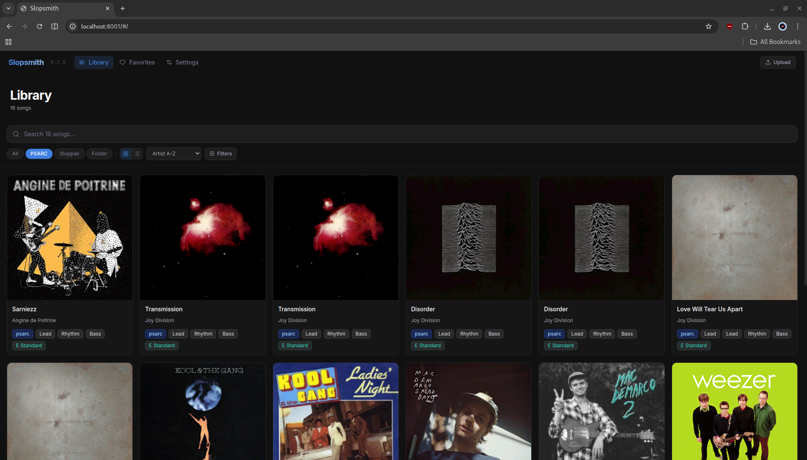
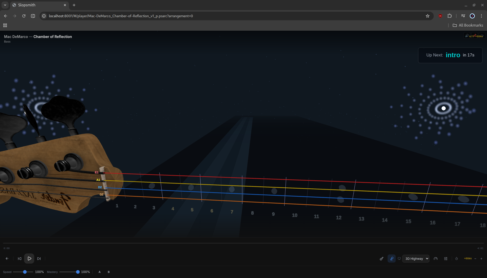

# Slopsmith Plus

A fork of SlopSmith is a self-contained web application for browsing, playing, and practicing Rocksmith 2014 Custom DLC (CDLC). Runs entirely in Docker — no local dependencies required.

[](https://www.youtube.com/watch?v=f_XTS9tVeaU)





> The screenshot above shows the **3D Highway** — a bundled visualization plugin selectable from the viz picker, featuring depth-aware camera, lighting, and per-string lane glow. 


> The **Classic 2D Highway** is also available in the picker for low-powered devices.

## Features

### Library Browser
- **Grid View** — album art cards with arrangement badges, tuning, lyrics indicator
- **Artist/Album Tree View** — hierarchical browser with letter filter (A-Z), expandable artist and album groups
- **Search** — filter by song title, artist, or album name
- **Sort** — by artist, title, recently added, or tuning
- **Favorites** — mark songs with a heart, browse favorites in a dedicated view
- **Edit Metadata** — update song title, artist, album, and album art directly from the library
- **Retune to E Standard** — pitch-shift songs in Eb/D/C#/C Standard to E Standard with one click

### Note Highway Player
A real-time note highway that renders Rocksmith arrangements as they would appear in the game. Bundled visualization options include a 3D highway with depth-aware camera, lighting, and per-string lane glow, and a classic 2D highway selectable from the visualization picker.

**Note rendering:**
- Fret-positioned notes with string colors (red, orange, blue, orange, green, purple)
- Open string bars spanning the highway
- Chord brackets connecting chord notes with chord name labels
- Sustain tails that stay visible until the sustain finishes

**Techniques:**
- Bends with curved arrows and labels (1/2, full, 1-1/2, 2)
- Unison bends with dashed connector and "U" label
- Slides (diagonal arrow)
- Hammer-ons / Pull-offs / Taps (H/P/T labels)
- Palm mutes (PM label)
- Vibrato (animated sustain)
- Tremolo (wavy line)
- Accents (> marker)
- Harmonics (diamond shape)
- Pinch harmonics (diamond + PH label)

**Note Reconition**
- Via YIN Algorithm Written in WASM for performance

**Additional features:**
- Synced lyrics display (phrase-based, multi-row, karaoke highlighting) — toggleable
- Dynamic anchor zoom — fret range adjusts smoothly, looks ahead at upcoming notes
- Arrangement switcher — switch between Lead, Rhythm, Bass during playback
- Speed control — continuous slider from 0.25x to 1.50x
- Volume control

### Practice Tools
- **A-B Looping** — set start (A) and end (B) points to repeat a section
- **Saved Loops** — name and save multiple loop sections per song, persisted across sessions
- **4-Count Click** — tempo-matched metronome count-in (1-2-3-4) before each loop repetition
- **Rewind Effect** — highway smoothly rewinds to the loop start point

### CDLC Creation
- **Create from Guitar Pro Tab** — search Ultimate Guitar for GP3/GP4/GP5 tabs and convert them to playable CDLC with MIDI audio (available as a plugin)

### Compatibility
- Supports both **custom CDLC** (from CustomsForge, etc.) and **official Rocksmith DLC**
- Official DLC: automatically converts SNG binary files to XML via built-in RsCli tool
- Reads arrangement names from manifest JSON (accurate Lead/Rhythm/Bass identification)

### Scalability
- **In-memory PSARC scanning** — reads metadata without writing to disk
- **Parallel scanning** — 8-thread metadata extraction
- **Server-side pagination and search** — SQLite-backed, handles 80,000+ songs
- **Non-blocking scan** — browse already-scanned songs while import continues in background

## Quick Start

### Prerequisites
- [Docker](https://docs.docker.com/get-docker/) and [Docker Compose](https://docs.docker.com/compose/install/)

### Run

1. Clone the repository:
   ```bash
   git clone https://github.com/byrongamatos/slopsmith.git
   cd slopsmith
   ```

2. Set your DLC folder path and start:
   ```bash
   DLC_PATH=/path/to/your/Rocksmith2014/dlc docker compose up -d
   ```

3. Open http://localhost:8000 in your browser.

On first launch, the app scans your DLC folder and imports metadata. A progress banner shows at the bottom of the screen. The library is usable while the scan runs.

### Configuration

- **DLC Folder** — set in Settings or via the `DLC_PATH` environment variable
- **Default Arrangement** — choose Lead, Rhythm, or Bass as the default when opening songs (Settings)

### Logging

Control log verbosity and format via environment variables:

| Variable | Default | Description |
|----------|---------|-------------|
| `LOG_LEVEL` | `INFO` | Severity threshold: `DEBUG`, `INFO`, `WARNING`, or `ERROR` |
| `LOG_FORMAT` | `text` | `text` for coloured console output; `json` for structured output (Loki, ELK, Promtail) |
| `LOG_FILE` | *(unset)* | If set, also write logs to this path (e.g. `/config/slopsmith.log`) |

### Reporting Bugs / Diagnostics

When you hit a bug, **Settings → Diagnostics → Export Diagnostics** produces a single zip containing everything a maintainer (or AI agent) needs to triage:

- Server logs (tail of `LOG_FILE`)
- System info (Python, OS, Slopsmith version)
- Hardware (CPU, RAM, GPU) — works in Docker, Electron (slopsmith-desktop), or bare Python
- Plugin inventory with git commit SHAs (so we know exactly which build you're on) — including orphaned plugins that failed to load
- Browser console transcript (all `console.log/info/warn/error/debug` + uncaught errors + promise rejections, last 500 entries)
- Browser hardware (WebGL renderer, WebGPU adapter)
- Per-plugin contributed diagnostics (when plugins opt in)

**Privacy:** redaction is on by default. DLC paths, song filenames, IP addresses, and bearer tokens are replaced with stable hashed tokens (`<song:a3f1c2d4>`) before the bundle is created. Click **Preview Bundle** to see exactly what's about to be exported.

Set `LOG_FILE` first if you want server logs included — without it the bundle still ships system + hardware + browser console, but the `logs/` section will be empty.

The bundle layout and per-file schemas are fully documented in [`docs/diagnostics-bundle-spec.md`](docs/diagnostics-bundle-spec.md). Top-level `manifest.json` carries a `schema` field on every JSON data file so AI agents can dispatch by version.

Attach the zip to a GitHub issue or share with whoever's helping you debug.

### Docker Compose Example

```yaml
services:
  web:
    build: .
    ports:
      - "8000:8000"
    volumes:
      # Mount your Rocksmith DLC folder
      - /path/to/Rocksmith2014/dlc:/dlc
      # Persistent config, cache, and favorites
      - slopsmith-config:/config
      # Optional: mount plugins for development
      # - ./plugins:/app/plugins
    environment:
      - DLC_DIR=/dlc
      - CONFIG_DIR=/config

volumes:
  slopsmith-config:
```
## Apache Reverse Proxy

To expose Slopsmith behind an Apache reverse proxy, add the following configuration to your virtual host:

```apache
ProxyPass /slopsmith/ http://localhost:8000/
ProxyPassReverse /slopsmith/ http://localhost:8000/

ProxyPass /api/ http://localhost:8000/api/
ProxyPassReverse /api/ http://localhost:8000/api/

ProxyPass /static/ http://localhost:8000/static/
ProxyPassReverse /static/ http://localhost:8000/static/

ProxyPass /ws ws://localhost:8000/ws

ProxyPass /audio/ http://localhost:8000/audio/
ProxyPassReverse /audio/ http://localhost:8000/audio/
```

Ensure the required Apache modules are enabled:

```bash
sudo a2enmod proxy
sudo a2enmod proxy_http
sudo a2enmod proxy_wstunnel
```

Then restart Apache:

```bash
sudo systemctl restart apache2
```

> **Note:** If Slopsmith is running on a different server, replace `localhost:8000` with the appropriate URL or IP address (e.g., `http://192.168.1.100:8000` or `http://slopsmith.internal:8000`).
>
> **Important:** Even though the app entrypoint is proxied at `/slopsmith`, Slopsmith currently uses absolute frontend paths (for example `/static/...` and `/api/...`). That is why the config also proxies `/api`, `/static`, `/ws`, and `/audio` at the virtual-host root. These root routes will be exposed and can conflict with an existing site that already uses the same paths.
>
> Slopsmith is not fully base-path aware yet, so it cannot be cleanly nested entirely under `/slopsmith` without additional rewriting or app changes. If you need to avoid route collisions, use a dedicated subdomain (for example `slopsmith.your-domain`) as the cleanest option.

## Proxmox LXC Container

`build-proxmox-ct.sh` builds a self-contained Proxmox LXC rootfs tarball from WSL2. It bootstraps a Debian Trixie rootfs, installs the runtime dependencies (Python, FFmpeg, fluidsynth, vgmstream) plus a build-only .NET SDK, builds RsCli, copies the app, removes the .NET SDK, and packages the result as a `.tar.zst` importable by `pct restore`.

```bash
# Prerequisites (WSL2):
sudo apt install debootstrap systemd-container tar zstd curl unzip git

# Build (run from repo root):
sudo bash build-proxmox-ct.sh amd64 slopsmith-ct

# Transfer + import on Proxmox:
scp slopsmith-ct.tar.zst root@proxmox:/var/lib/vz/template/cache/
pct restore 200 /var/lib/vz/template/cache/slopsmith-ct.tar.zst \
    --storage local-lvm --rootfs 8 --memory 2048 --cores 2 \
    --net0 name=eth0,bridge=vmbr0,ip=dhcp --unprivileged 1 --start 1
```

Override the Rocksmith install root (the directory that contains both `dlc/` and `songs.psarc`) via environment, using `sudo env` so the variable survives `sudo`: `sudo env ROCKSMITH_SRC_DIR=/path/to/Rocksmith2014 bash build-proxmox-ct.sh amd64 slopsmith-ct`.

The build copies `*_p.psarc` files from `${ROCKSMITH_SRC_DIR}/dlc/` and `songs.psarc` from `${ROCKSMITH_SRC_DIR}/` — point the variable at the install root, not at the `dlc/` folder. .NET is installed only as a build dependency; RsCli is published with `--self-contained`, so the system-wide .NET tree is removed before the rootfs is packaged (the runtime ships bundled inside `RsCli`).

The build verifies downloaded files (vgmstream, dotnet-install.sh) against pinned SHA256 hashes. Set `SKIP_HASH_CHECK=1` to bypass verification — useful when an upstream artifact (e.g. `dot.net/v1/dotnet-install.sh`) rolls and the pinned hash hasn't been refreshed yet:

```bash
sudo env SKIP_HASH_CHECK=1 bash build-proxmox-ct.sh amd64 slopsmith-ct
```

The script is linted with `shellcheck`. Only `amd64` is supported out of the box; `arm64` requires `qemu-user-static` + binfmt registration.

## Portainer Setup

This guide walks through installing Docker, Portainer, and Slopsmith on Ubuntu.

**Step 1:** Update Package Lists & install docker
```bash
sudo apt update
sudo apt install docker.io -y
sudo usermod -aG docker $USER
```
**Step 2:** Install Portainer on Ubuntu
```bash
sudo docker pull portainer/portainer-ce:latest
sudo docker run -d -p 9000:9000 --restart always -v /var/run/docker.sock:/var/run/docker.sock portainer/portainer-ce:latest
```
**Step 3:** Access the Portainer Web Interface
Open the following URL in your browser:

    • http://server-ip:9000

**Step 4:** Pull the Slopsmith Image
In Portainer, go to the Images tab and build a new image using the following settings:

    • Image Name: slopsmith:latest
    
    • Repository URL: https://github.com/byrongamatos/slopsmith.git

**Step 5:** Create a Stack for Slopsmith
Click '+ Add Stack' and paste the following Docker Compose configuration into the editor. Replace '/path/to/dlc/' with the correct path where your dlc is on your host system.
```bash
version: "3.9"

services:
  web:
    image: slopsmith:latest
    container_name: slopsmith-web
    restart: unless-stopped

    ports:
      - "7000:8000"

    volumes:
      - /path/to/dlc/:/dlc
      - slopsmith-config:/config

    environment:
      DLC_DIR: /dlc
      CONFIG_DIR: /config

volumes
  slopsmith-config:
```
Click 'Deploy the stack'. This creates a container named 'slopsmith-web'.
Access Slopsmith at: http://server-ip:7000

**Step 6:** Add the Update Manager

Clone the Update Manager repository on the host machine and copy to container.
```bash
cd /home/your_user
git clone https://github.com/byrongamatos/slopsmith-update-manager.git update_manager
sudo docker cp /home/your_user/update_manager slopsmith-web:/app/plugins/
```
**Step 7:** Restart the Slopsmith Container

In the Portainer web interface, go to Containers, select 'slopsmith-web', and restart the container.

**Step 8:** Install Recommended Plugins

Open Slopsmith at http://server-ip:7000 and install the following recommended plugins via the update manager:

    • NAM Tone Engine - Enables Slopsmith to interface with your guitar/audio cable.
        1. Download amp models and cabinet IRs from: https://www.tone3000.com/
        
    • Note Detection - Allows Slopsmith to detect the notes you are playing.

## Windows 11 install tutorial

https://youtu.be/bIz8pbTFiV8

## Plugins

Slopsmith Plus does not yet support Plugins, plugin support is work in progress with an compatbility layer for SlopSmith 


## AI Agent Guide

This repo includes a [`CLAUDE.md`](CLAUDE.md) file with architecture overview, plugin conventions, and best practices for AI coding agents (Claude Code, etc.). If you're using AI tools to contribute, the guide is picked up automatically. If you're updating conventions or patterns, please keep `CLAUDE.md` in sync.

## Tech Stack

- **Backend**: Typescript / Node / FastAPI / Postgress / WebSocket
- **Frontend**: Vue / Canvas 2D / Tailwind CSS (CDN) / WASM
- **PSARC**: Custom AES-CFB-128 decryptor with in-memory reading
- **SNG Compiler**: F# CLI tool wrapping [Rocksmith2014.NET](https://github.com/iminashi/Rocksmith2014.NET)
- **Audio**: vgmstream (WEM decode) / FFmpeg / FluidSynth (MIDI render) / rubberband (pitch shift) /
- **Docker**: Self-contained image with all dependencies

## Running tests

Core library modules have a small pytest suite (pure functions only — no fixtures, no Docker). To run it locally:

```bash
pip install -r requirements.txt -r requirements-test.txt
pytest
```

CI runs the same suite on every push and PR against `main` (see `.github/workflows/tests.yml`). Contributions adding tests are welcome — the current targets are `lib/tunings.py` and `lib/song.py`; natural follow-ups would be the pure helpers in `lib/sloppak_convert.py` and the tempo/tick math in `lib/gp2rs.py`.


## License

Slopsmith Plus is licensed under the [GNU Affero General Public License v3.0](LICENSE) (AGPL-3.0-only).

You are free to use, modify, and redistribute Slopsmith — including running it on your own server. If you distribute modified versions, or run a modified version that interacts with users over a network, you must make the corresponding source code available under the same license. See [CONTRIBUTING.md](CONTRIBUTING.md) for contributor terms (DCO sign-off, plugin licensing policy).

Bundled and vendored third-party code retains its original license — see [`rscli/LICENSE`](rscli/LICENSE) for the F# wrapper based on [Rocksmith2014.NET](https://github.com/iminashi/Rocksmith2014.NET) (MIT), and individual plugin repositories for plugin licenses.
